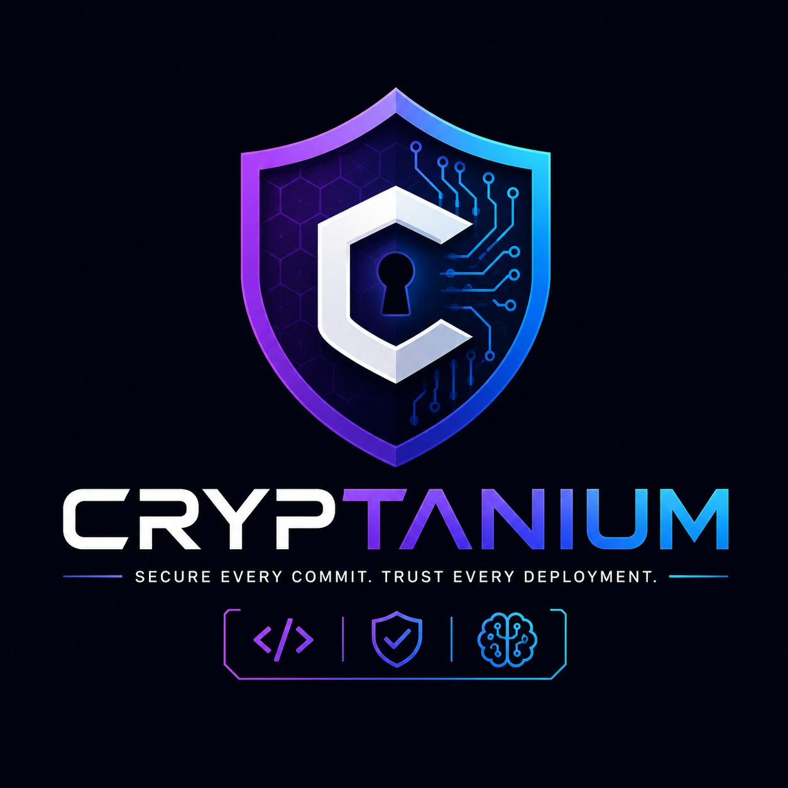

# Cryptanium



Secure every commit. Trust every deployment.

Cryptanium's canonical scanner engine owns repository cloning, temporary workspace management, project/language/package detection, parallel orchestration, Semgrep, Bandit, Gitleaks, pip-audit, npm audit, ESLint, result parsing/normalization, and cleanup. Database, API, JWT, OAuth, AI, reports, and trust scoring are separate application concerns.

## Run with Docker

Copy `.env.example` to `.env`, replace `SECRET_KEY` and `POSTGRES_PASSWORD` with random values, then run `docker compose up --build`. The API is available on port 8000 and the React Vite frontend on port 5173.

## End-to-end usage

### Docker

Open `http://localhost:5173`; API docs are at `http://localhost:8000/docs`. The default Compose profile uses persistent SQLite, so no `POSTGRES_PASSWORD` is required:

```bash
docker compose up --build -d
```

For local PostgreSQL instead, use `POSTGRES_PASSWORD=... DATABASE_URL=postgresql://cryptanium:...@db:5432/cryptanium_db docker compose --profile postgres up --build`.

For Neon deployment, set `DATABASE_URL` to the Neon pooled URL with `sslmode=require`; do not start the local `db` service. Set `GITHUB_REDIRECT_URI` to `https://YOUR-API-DOMAIN/auth/callback` and register that exact URL in the GitHub OAuth application. Local GitHub OAuth uses `http://localhost:8000/auth/callback`.

### Manual development

```bash
python -m venv .venv
pip install -r backend/requirements.txt
uvicorn backend.app.main:app --reload --host 127.0.0.1 --port 8000
cd frontend
npm ci
npm run dev -- --host 127.0.0.1 --port 5173
```

### Scanner operation

The engine detects project types and runs compatible tools: Semgrep, Bandit, Gitleaks, pip-audit, npm audit, and ESLint. To run individual tools, include a `tools` array in the scan request:

```json
{"repository_name":"owner/project","tools":["semgrep","gitleaks"]}
```

Valid names are `semgrep`, `bandit`, `gitleaks`, `pip-audit`, `npm-audit`, and `eslint`. Omit `tools` to run all compatible scanners. Set `SCANNER_MAX_CONCURRENCY=1` or `2` for Render free-tier stability. Each tool produces an independent result; partial failures do not discard successful findings.

### AI summaries

Set `OPENROUTER_API_KEY` to enable AI summaries and remediation recommendations. Prompts use only normalized findings. If the provider is unavailable, deterministic rule-based remediation is returned instead of fabricated findings.

> **Forging Trust. Securing Code.**

Cryptanium is an AI-powered Repository Trust & Security Analysis Platform that scans GitHub repositories using multiple SAST, secret, and dependency scanners, calculates a transparent **Repository Trust Score**, and generates executive AI summaries and prioritized remediation guidance before deployment.

---

## Key Features

- **Automated Multi-Tool Security Scanning**: Integrates Semgrep, Bandit, Gitleaks, pip-audit, npm audit, and ESLint.
- **Repository Trust Score Engine**: Pluggable Strategy pattern calculating objective security trust scores $[0, 100]$ with risk classifications (`Excellent`, `Good`, `Moderate`, `Risky`, `Critical`).
- **Zero-Hallucination AI Summaries & Remediation**: Powered by OpenRouter and Nemotron Flash (`nvidia/nemotron-4-340b-instruct`) with deterministic offline rule fallbacks.
- **Publication-Ready PDF Audit Reports**: Dynamic ReportLab Platypus reports with OWASP mappings, breakdown tables, and two-pass page numbering.
- **Clean Architecture & RESTful API**: Built with FastAPI, Pydantic v2, SQLAlchemy ORM, and React + TypeScript + Vite.
- **Docker & Cloud Deployment**: Full Docker Compose setup and Render deployment readiness.

---

## Quickstart

### 1. Clone & Setup Environment
```bash
git clone https://github.com/venkatesh-99-cbs/Cryptanium.git
cd Cryptanium
cp .env.example .env
```

### 2. Run Locally with Docker
```bash
docker compose up --build -d
```
- **Backend API**: `http://localhost:8000`
- **Interactive OpenAPI Docs**: `http://localhost:8000/docs`

### 3. Run Backend Without Docker
```bash
pip install -r backend/requirements.txt
uvicorn backend.app.main:app --reload --host 127.0.0.1 --port 8000
```

### 4. Run Frontend
```bash
cd frontend
npm install
npm run dev
```
Open browser at `http://localhost:3000`.

---

## Documentation Links

- 📖 [REST API Documentation](docs/API.md)
- 📐 [Architecture Specification](docs/ARCHITECTURE.md)
- 🚀 [Presentation & Pitch Guide](docs/PRESENTATION.md)
- 👤 [User & Operator Guide](docs/USER_GUIDE.md)
- 🛠️ [Developer & Contributor Guide](docs/DEVELOPER_GUIDE.md)

---

## License
MIT License - see `LICENSE` for details.
